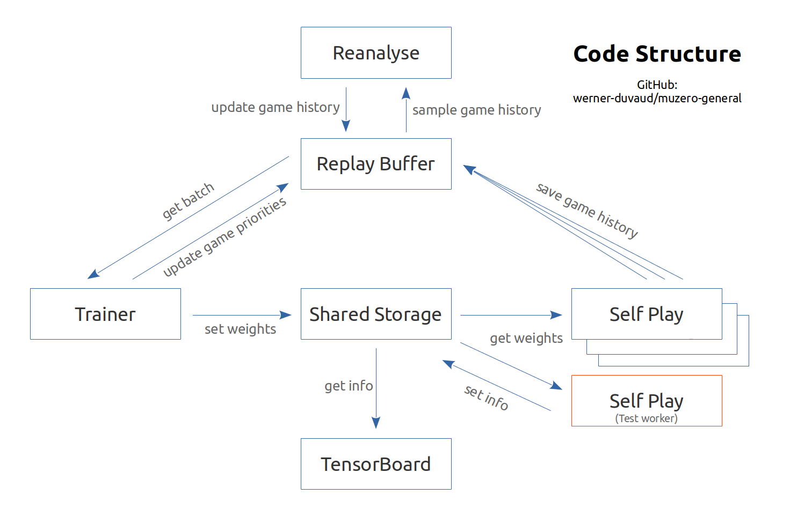

## 说明文档

### Features

- [x] Residual Network
- [ ] MCTS with stochastic environment 
- [ ] Monte Carlo Tree Search (with/without network)
- [ ] Set proper rewards
- [ ] Multiprocessing
- [ ] TensorBoard real-time monitoring
- [x] Single player mode
- [ ] Two player mode
- [ ] comments
- [ ] ...

### 代码架构

大致如下图所示（不完全一致）

### 代码说明

- [ ] TODO

### 特征选取

`[(4 + 2k), 10, 20]`

- 我方蛇全身位置（当前阶段以及前k-1个阶段）
- 我方当前蛇头位置

- 敌方蛇全身位置（当前阶段以及前k-1个阶段）

- 敌方当前蛇头位置

- 所有豆的位置

- 全0/1矩阵表示哪个玩家正在决策

### 网络架构

目前版本是Alpha-Zero的简化版

